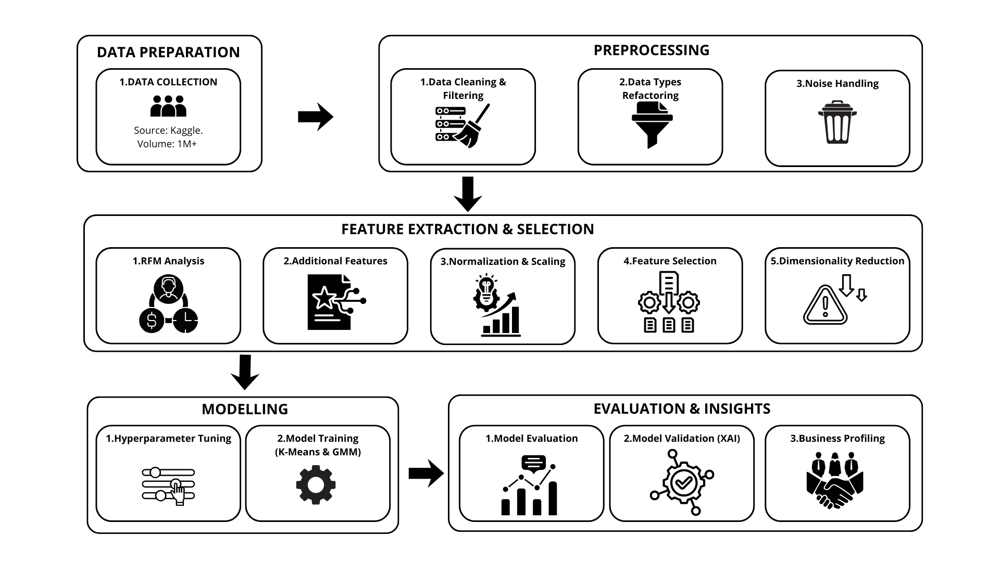

# Customer-Segmentation-Using-K-Means-and-GMM

## Project Overview
This project presents a comprehensive customer segmentation framework for e-commerce platforms using unsupervised machine learning techniques. The primary goal is to identify distinct customer groups based on purchasing behavior to support targeted marketing, retention, and reactivation strategies.

Two clustering methods are applied and compared: K-Means and Gaussian Mixture Model (GMM). The project integrates RFM (Recency, Frequency, Monetary) analysis with derived behavioral features, probabilistic clustering, and explainable AI (XAI) to ensure both accurate segmentation and interpretability.

## Features
This project implements machine learning techniques for customer segmentation on e-commerce transaction data. Key features include:
- **Customer Segmentation:** Identifies four distinct customer groups based on RFM and CV Spending features.  
- **Clustering Methods:** Implements K-Means (hard clustering) and Gaussian Mixture Model (soft clustering).  
- **Model Evaluation:** Provides clustering evaluation using Silhouette Score, Calinski-Harabasz Index, and Davies-Bouldin Index.  
- **Visualization:** Generates cluster visualizations with UMAP for dimensionality reduction and Radar Charts for segment profiling.  
- **Explainable AI:** Uses SHAP values to highlight the most influential features affecting cluster formation, such as Recency and spending consistency.

## Dataset

The project uses the **Retail Transactions: Online Sales Dataset** from Kaggle. The dataset contains detailed transaction records from a UK-based online retail store between 2010 and 2011, with a total of 1067370 rows representing individual purchases. It covers various product categories, including home decor, gifts, and seasonal items, primarily sold in the United Kingdom.

**Dataset References:** [link](https://www.kaggle.com/datasets/shashanks1202/retail-transactions-online-sales-dataset)

## Setup Instructions
Follow these steps to set up the project environment on your local machine.

### 1. Clone this repository

### 2. Open Bash terminal, create virtual environment in "Customer-Segmentation-Using-K-Means-and-GMM" folder 
```bash
# Windows
python -m ensurepip --default-pip
python -m venv venv --upgrade-deps

# if you using linux or mac, use python3 command instead of python
```

### 3. Activate the virtual environment
```bash
# Linux / MacOS
source venv/bin/activate

# Windows (Git Bash)
source venv/Scripts/activate
```

### 4. Install ipykernel
```bash
python -m pip install ipykernel
```

### 5. Register the virtual environment as a Jupyter kernel
```bash
python -m ipykernel install --user --name=venv --display-name "Python (venv)"
```

### 6. Install project dependencies
```bash
python -m pip install -r requirements.txt
```

### 7. Open & Run the project, ensure that you selected the "Python (venv)" kernel before running the cells.

## Requirements

### Python
This project requires **Python 3.10 or higher**.  
Check your Python version:

```bash
python3 --version   # Linux/macOS
python --version    # Windows
```

### pip

Make sure pip is installed and up-to-date:

```bash
python -m ensurepip --upgrade   # Windows
python3 -m ensurepip --upgrade  # Linux/macOS

python -m pip install --upgrade pip
```

### Python Packages

Install the required Python packages listed in requirements.txt:
```bash
pip install -r requirements.txt
```

Key Dependencies Used in This Project
- numpy
- pandas
- scipy
- matplotlib
- seaborn
- scikit-learn
- yellowbrick
- umap-learn
- shap

```markdown
> Note: It's recommended to use a virtual environment to avoid conflicts with global packages.
```

## Model Pipeline



## Code Repository / DOI
